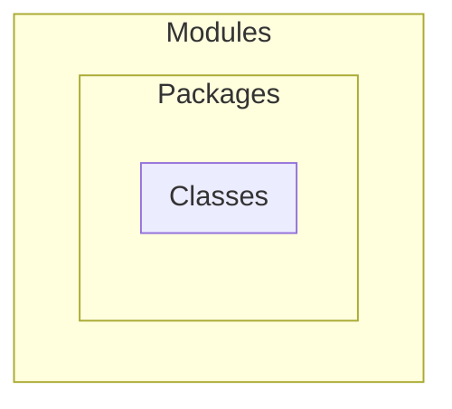

## Backwards Compatibility
"Do no harm" - a principle the language follows when updating / adding features. 
Businesses that are built in Java can be sure that their old source code will compile on newer versions of Java.

## Openness
Rigorous specifications of The [JVM](https://docs.oracle.com/javase/specs/jvms/se25/jvms25.pdf) & Java [Language](https://docs.oracle.com/javase/specs/jls/se25/jls25.pdf) exist.
These define how the JDK should look and function. Many [vendors / community leaders](https://docs.oracle.com/javase/specs/jvms/se25/jvms25.pdf) can use this to distribute their own implementations of Java. 
Most common implementations of the JDK include Amazon, Microsoft and IBM. 

Oracle (the company who owns Java) have their own reference implementation called [OpenJDK](https://openjdk.org/). 
This is opensource with development taking place on [GitHub](https://github.com/openjdk).

## The Language
Java focuses on Object Oriented programming, bringing classes which encapsulate some *thing, A* of certain properties (fields) and behaviours (methods). 
Another thing, *B* can extend *A*, inheriting its methods and fields while also adding functionality that *A* doesn't have.
These classes can be collected into packages, which can further be collected into modules:

It also uses explicit type casting which, of many things, allows the compiler to catch errors early on before runtime. 

## Java Runtime
### Portability
Write Once, Run Anywhere. This is the principle the JVM allows. This portability is the result of splitting the platform into the 3 parts we covered in md-1. 
The only thing we'd have to swap to run source code on another OS or CPU architecture is the JVM. 
Neither our source code nor bytecode, nor the SE APIs we use need to change, meaning no refactoring or recompiling is required.

This portability becomes a problem only when the intention is to write a program that integrates deeply with the existing architecture. 
### Auto Management
The JVM will efficiently manage memory for us. This includes both the allocation of it and its garbage collection. 
This allows devs to think about business logic purely without thinking much about memory management. 

Multi threading is also handled for us in the JVM, where code will be scheduled to run in parallel across many CPU cores/threads. 
Combine this with the [Concurrency standard library](https://docs.oracle.com/javase/tutorial/essential/concurrency/) to write high performance, multi-threaded code.
For more info, have a look at Just-in-Time compilation.