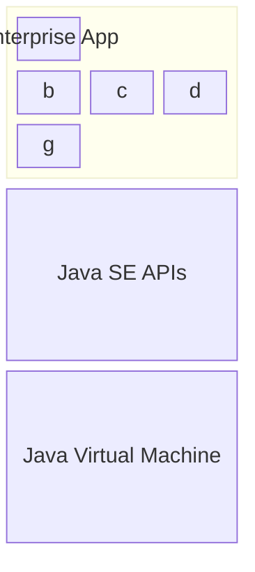

## Desktop Java Development
Swing is a desktop app development toolkit for Java. 
It offers Pure, Java-based UI controls as well as cross-platform looks. Intellij IDEA was actually built in this. 
Using it right now to make these notes in fact. 

OpenJFX / FXML (decouples GUI Design from app code) are the modern approach for advanced controls, animations/3D Graphics, and supports CSS (See "Skinnable").
This is a subproject of the JDK and doesn't get shipped with it. For making desktop apps with purely the JDK, Swing works fine. Mainstream app dev focuses on WebApps though. 

## Enterprise Java (JEE)
Big apps tend to use **a lot** of 3rd party libraries for common functionality. 
For really complex apps, this can bleed into the hundreds which would *suck* to select manage manually. 
And so we have another acronym, JEE. 
This enterprise edition of Java (now named _) is a stack of pre-packaged tech built on top of the Java SE APIs mentioned in md-1.

JEE provides lots of features including:
- Data persistance
- Web applications
- Security
- Messaging
- JSON/XML handling

