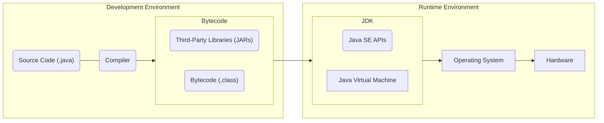

# The Platform

## The JDK
We can split Java into the 3 parts below. These make up the Java Development Kit (JDK). This contains all the tools needed to run Java apps. 

### 1. Programming Language
Defines Syntax, keywords file structure, etc.
### 2. Runtime Environment
Where Java code is executed. This abstracts away the code from the underlying hardware, meaning it can run anywhere. 
### 3. Standard Library
Collection of code written for us so that we aren't constantly re-inventing the wheel.
## The Development Cycle
