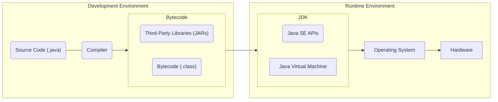

# The Platform

## JDK, JRE, JDE, JVM, JSE-API 
We can split Java into the 3 basic parts below:

### 1. Programming Language
Defines Syntax, keywords file structure, etc.
### 2. Runtime Environment
Where Java code is executed. The Java Virtual Machine (JVM) and Standard Edition APIs (JSE-API) make up the (JDK) - The Java Development Kit.
The JVM is responsible for abstracting away Bytecode and turning it into machine code readable by the OS & Hardware it sits in. 
### 3. Standard Library
Collection of code written for us so that we aren't constantly re-inventing the wheel. Third party libraries exist too, but they don't come prepackaged with Java. 

## The Development Cycle
